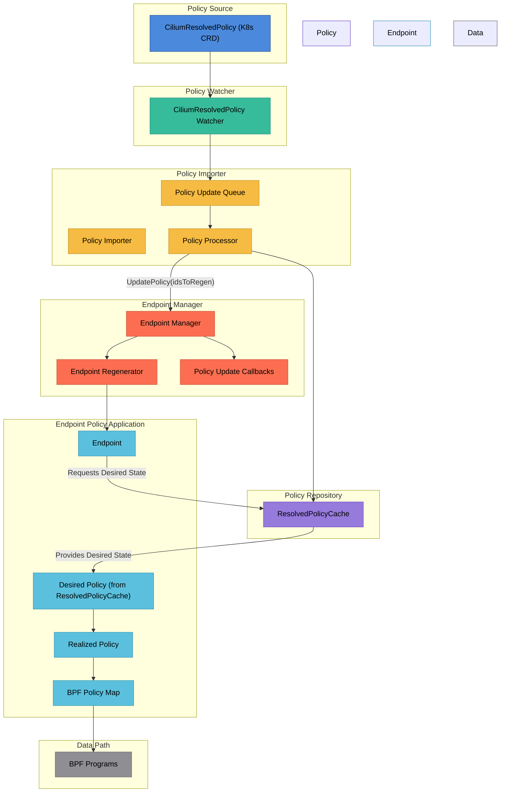

# Cilium New Policy Creation Flow (with CiliumResolvedPolicy)

This document describes the updated architecture and flow of how network policies are created, processed, and applied in Cilium, focusing on the `CiliumResolvedPolicy` custom resource.

## Architecture Overview Diagram

## Flow Summary (New)

\`\`\`
CiliumResolvedPolicy (K8s CRD)
    ↓
CiliumResolvedPolicy Watcher (detects changes in CiliumResolvedPolicy resources)
    ↓
Policy Importer (processes, queues, and batches policy updates)
    ↓
Policy Repository (stores updates in ResolvedPolicyCache)
    ↓
Endpoint Manager (coordinates updates to affected endpoints)
    ↓
Endpoint (requests desired policy state from ResolvedPolicyCache)
    ↓
Endpoint Policy Application (calculates and applies policies to endpoints)
    ↓
BPF Maps and Programs (enforce policies in the datapath)
\`\`\`

## Component Descriptions (Updated)

### Policy Source
- **CiliumResolvedPolicy (K8s CRD)**: The sole source for pre-resolved network policies.

### Policy Watcher
- **CiliumResolvedPolicy Watcher**: Watches Kubernetes API for `CiliumResolvedPolicy` resource changes. Translates these into a common internal representation and forwards them to the Policy Importer.

### Policy Importer
- **Policy Queue**: Buffers incoming policy updates for batched processing.
- **Policy Processor**: Core processing logic that:
  - Updates policies in the `ResolvedPolicyCache`.
  - Tracks affected identities for endpoint regeneration.
  - Sends policy update notifications.

### Policy Repository
Central storage for resolved policies:
- **ResolvedPolicyCache**: Caches the `CiliumResolvedPolicy` objects. Endpoints directly query this cache for their desired policy state.

### Endpoint Manager
- **Endpoint Manager**: Manages all endpoints in the node.
- **Endpoint Regenerator**: Handles endpoint regeneration process when underlying `CiliumResolvedPolicy` changes affect an endpoint.
- **Policy Update Callbacks**: Notifies registered components about policy changes.

### Endpoint Policy Application
- **Endpoint**: Represents a container/pod network endpoint.
- **Desired Policy**: The policy state fetched directly from `ResolvedPolicyCache`.
- **Realized Policy**: The policy that has been successfully translated and applied to the datapath.
- **Policy Map**: BPF map containing policy rules enforced in the datapath.

### Data Path
- **BPF Programs**: Kernel programs that enforce policies at the datapath level.

## New Policy Creation Flow Steps

1.  **Policy Event Detection**:
    *   Changes to `CiliumResolvedPolicy` resources are detected by the dedicated `CiliumResolvedPolicy Watcher`.

2.  **Policy Translation (Minimal)**:
    *   The watcher forwards the `CiliumResolvedPolicy` (or relevant parts) to the policy importer.

3.  **Policy Queuing**:
    *   Updates are sent to the policy importer's queue.
    *   Updates are batched for efficient processing.

4.  **ResolvedPolicyCache Update**:
    *   The Policy Processor pushes the `CiliumResolvedPolicy` updates into the `ResolvedPolicyCache`.
    *   The set of affected identities/endpoints is calculated.

5.  **Endpoint Notification & Regeneration**:
    *   Endpoint Manager is notified with a list of affected endpoints.
    *   For affected endpoints, regeneration is triggered.

6.  **Endpoint Fetches Desired State**:
    *   The Endpoint, during its regeneration or policy update cycle, directly requests its desired policy state from the `ResolvedPolicyCache`.

7.  **Endpoint Policy Application**:
    *   Endpoint translates the desired policy into policy map updates.
    *   Realized policy is set after successful application.

8.  **BPF Map Updates**:
    *   Policy map changes are applied to BPF maps.
    *   Datapath starts enforcing the new policy rules.
