# Cilium Pod Creation Flow

This document describes the architecture and flow of how pods are created, configured, and connected to the network in Cilium.

## Architecture Overview Diagram

```mermaid
flowchart TB
    %% Color scheme for components - optimized for both light and dark backgrounds
    %% Kubernetes Components - Medium Blue
    %% CNI Components - Medium Green
    %% IPAM - Medium Yellow
    %% Endpoint Creation - Medium Orange
    %% Identity Management - Medium Purple
    %% BPF/Datapath - Medium Red
    %% Networking - Medium Teal

    subgraph "Kubernetes Components" 
        style Kubernetes Components fill:#4b89dc,stroke:#2c5499,color:#000
        kubelet["Kubelet"]
        kube_apiserver["Kubernetes API Server"]
        
        %% Style all nodes in this subgraph
        style kubelet fill:#4b89dc,stroke:#2c5499,color:#000
        style kube_apiserver fill:#4b89dc,stroke:#2c5499,color:#000
    end

    subgraph "CNI Plugin" 
        style CNI Plugin fill:#37bc9b,stroke:#2b9484,color:#000
        cilium_cni["Cilium CNI Plugin"]
        
        %% Style all nodes in this subgraph
        style cilium_cni fill:#37bc9b,stroke:#2b9484,color:#000
    end
    
    subgraph "IPAM"
        style IPAM fill:#f6bb42,stroke:#c69426,color:#000
        ipam_allocation["IP Allocation"]
        ipam_pool["IPAM Pool"]
        delegated_ipam["Delegated IPAM (optional)"]
        
        %% Style all nodes in this subgraph
        style ipam_allocation fill:#f6bb42,stroke:#c69426,color:#000
        style ipam_pool fill:#f6bb42,stroke:#c69426,color:#000
        style delegated_ipam fill:#f6bb42,stroke:#c69426,color:#000
    end
    
    subgraph "Endpoint Creation"
        style Endpoint Creation fill:#e9573f,stroke:#b94632,color:#000
        direction TB
        cilium_agent["Cilium Agent"]
        endpoint_manager["Endpoint Manager"]
        endpoint_creator["Endpoint Creator"]
        endpoint_regeneration["Endpoint Regeneration"]
        
        %% Style all nodes in this subgraph
        style cilium_agent fill:#e9573f,stroke:#b94632,color:#000
        style endpoint_manager fill:#e9573f,stroke:#b94632,color:#000
        style endpoint_creator fill:#e9573f,stroke:#b94632,color:#000
        style endpoint_regeneration fill:#e9573f,stroke:#b94632,color:#000
    end
    
    subgraph "Cilium Endpoint Resources"
        style Cilium Endpoint Resources fill:#967adc,stroke:#7652c6,color:#000
        direction TB
        cep["CiliumEndpoint (CEP)"]
        ces["CiliumEndpointSlice (CES)"]
        endpoint_identity["Identity Assignment"]
        
        %% Style all nodes in this subgraph
        style cep fill:#967adc,stroke:#7652c6,color:#000
        style ces fill:#967adc,stroke:#7652c6,color:#000
        style endpoint_identity fill:#967adc,stroke:#7652c6,color:#000
    end
    
    subgraph "BPF/Datapath Setup"
        style BPF/Datapath Setup fill:#fc6e51,stroke:#cd5940,color:#000
        bpf_maps["BPF Maps Creation"]
        policy_maps["Policy Map"]
        routing_setup["Routing Setup"]
        
        %% Style all nodes in this subgraph
        style bpf_maps fill:#fc6e51,stroke:#cd5940,color:#000
        style policy_maps fill:#fc6e51,stroke:#cd5940,color:#000
        style routing_setup fill:#fc6e51,stroke:#cd5940,color:#000
    end
    
    subgraph "Networking Configuration"
        style Networking Configuration fill:#5bc0de,stroke:#3998b6,color:#000
        direction TB
        veth_pair["Veth Pair Creation"]
        dns_config["DNS Configuration"]
        
        %% Style all nodes in this subgraph
        style veth_pair fill:#5bc0de,stroke:#3998b6,color:#000
        style dns_config fill:#5bc0de,stroke:#3998b6,color:#000
    end

    %% Connections between components - The Pod Creation Flow
    kubelet -->|"Step 1: Pod creation event"| kube_apiserver
    kubelet -->|"Step 2: Call CNI ADD"| cilium_cni
    
    cilium_cni -->|"Step 3: Initialize CNI context"| cilium_cni
    cilium_cni -->|"Step 4: Get daemon configuration"| cilium_agent
    
    cilium_cni -->|"Step 5a: Request IP allocation"| ipam_allocation
    ipam_allocation -->|"Step 5b: Allocate from pool"| ipam_pool
    ipam_allocation -->|"Step 5c: Use delegated plugin (optional)"| delegated_ipam
    ipam_allocation -->|"Step 5d: Return allocated IP"| cilium_cni
    
    cilium_cni -->|"Step 6: Create veth pair"| veth_pair
    
    cilium_cni -->|"Step 7: Prepare endpoint request with allocated IP"| cilium_cni
    cilium_cni -->|"Step 8: Send endpoint creation request"| cilium_agent
    
    cilium_agent -->|"Step 9: Create endpoint"| endpoint_creator
    endpoint_creator -->|"Step 10: Configure endpoint"| endpoint_manager
    
    endpoint_manager -->|"Step 11: Apply configuration"| endpoint_regeneration
    endpoint_regeneration -->|"Step 12: Request identity"| endpoint_identity
    
    endpoint_identity -->|"Step 13: Configure BPF maps"| bpf_maps
    bpf_maps -->|"Step 14: Setup policy maps"| policy_maps
    bpf_maps -->|"Step 15: Configure routing"| routing_setup
    
    endpoint_regeneration -->|"Step 16: Configure DNS"| dns_config
    
    endpoint_regeneration -->|"Step 17: Create CiliumEndpoint"| cep
    cep -->|"Step 18: Group into slices"| ces
    
    cilium_agent -->|"Step 19: Return endpoint status"| cilium_cni
    cilium_cni -->|"Step 20: Return result to kubelet"| kubelet
```



### Flow Summary

```
Step 1: Kubernetes Components (Kubelet, API Server) initiate pod creation
Step 2: Kubelet calls Cilium CNI Plugin
Steps 3-4: CNI Plugin initializes and gets daemon configuration
Steps 5a-5d: IP address allocation happens (before endpoint creation)
Step 6: Create veth pair for networking
Step 7: Prepare endpoint request with the allocated IP
Step 8: Send endpoint creation request to Cilium Agent
Steps 9-10: Cilium Agent creates and configures endpoint
Step 11: Endpoint Manager applies configuration
Step 12: Endpoint regeneration requests identity
Steps 13-15: BPF maps are configured (policy, routing)
Step 16: DNS is configured
Steps 17-18: CiliumEndpoint and CiliumEndpointSlice resources are created
Steps 19-20: Endpoint status and result returned to kubelet
```

## Component Descriptions

### Kubernetes Components
- **Kubelet**: The Kubernetes node agent responsible for managing pods
- **Kubernetes API Server**: Central management component that stores pod definitions and status

### CNI Plugin
- **Cilium CNI Plugin**: Implements the Container Network Interface (CNI) spec, which is called by kubelet to set up networking for new pods

### IPAM (IP Address Management)
- **IP Allocation**: Handles the allocation of IP addresses for pods
- **IPAM Pool**: Source of available IP addresses managed by Cilium
- **Delegated IPAM**: Optional external IPAM plugin that can be used instead of Cilium's internal IPAM

### Endpoint Creation
- **Cilium Agent**: Central daemon that manages Cilium networking, security, and load balancing
- **Endpoint Manager**: Manages the lifecycle of all endpoints in the node
- **Endpoint Creator**: Responsible for creating new endpoint instances
- **Endpoint Regeneration**: Handles the process of regenerating an endpoint's configuration, including BPF program compilation

### Cilium Endpoint Resources
- **CiliumEndpoint (CEP)**: Kubernetes Custom Resource representing a Cilium endpoint's networking configuration
- **CiliumEndpointSlice (CES)**: Optimized grouping of CiliumEndpoints for efficient distribution and synchronization
- **Identity Assignment**: Process of assigning security identities to endpoints based on labels

### BPF/Datapath Setup
- **BPF Maps Creation**: Creates and initializes the BPF maps needed for the endpoint
- **Policy Map**: BPF map containing policy rules for an endpoint
- **Routing Setup**: Configures routing rules for the endpoint

### Networking Configuration
- **Veth Pair Creation**: Creates virtual ethernet interface connecting the container to the host
- **DNS Configuration**: Sets up DNS handling for the endpoint

## Pod Creation Flow in Detail

### 1-2. Initial Pod Creation and CNI Invocation
When Kubernetes schedules a pod to a node:
- Kubernetes API Server records the pod creation
- Kubelet on the node detects the new pod assignment
- Kubelet creates the pod's containers and namespaces
- Kubelet calls the configured CNI plugin (Cilium) with a CNI ADD command, including the container ID, network namespace path, and other metadata

### 3-4. CNI Plugin Initialization
- The Cilium CNI plugin processes the CNI ADD command
- It contacts the Cilium Agent to get the daemon configuration
- The plugin validates the configuration and determines how to proceed

### 5. IP Address Allocation
- **Important**: IP allocation happens before endpoint creation
- The CNI plugin calls one of two functions:
  - `allocateIPsWithCiliumAgent`: Requests IP allocation from the Cilium Agent
  - `allocateIPsWithDelegatedPlugin`: Uses an external IPAM plugin if configured
- The IP address is allocated from the appropriate IPAM pool
- The allocated IP address is returned to the CNI plugin

### 6. Network Interface Setup
- A virtual ethernet (veth) pair is created 
- One end is placed in the pod's namespace
- The other end remains in the host namespace

### 7-8. Endpoint Configuration and Creation
- The CNI plugin constructs an EndpointChangeRequest that includes:
  - The allocated IP addresses
  - Container ID and interface name
  - Kubernetes pod name, namespace, and UID
  - Labels from the pod's metadata
- This request is sent to the Cilium Agent via its API

### 9-10. Endpoint Creation in Cilium Agent
- The Cilium Agent receives the request and calls the Endpoint Creator
- The creator initializes a new Endpoint object with the allocated IP and a unique ID
- The Endpoint Manager adds the new endpoint to its registry

## Label Processing and Security Identity Allocation

### Labels Extraction and Processing
When the Cilium agent receives the endpoint creation request:

1. **Label Extraction**:
   - Labels are extracted from multiple sources:
     - Kubernetes pod labels (from Pod metadata)
     - Namespace labels (prefixed with `k8s:io.kubernetes.pod.namespace=`)
     - Pod-specific labels including:
       - `k8s:io.kubernetes.pod.name=<pod-name>`
       - `k8s:io.cilium.k8s.namespace.labels.<namespace-label>=<value>`
       - `k8s:app.kubernetes.io/name=<app-name>`
     - Orchestration system labels (like `k8s:io.kubernetes.pod.namespace=default`)
   - The labels follow a source:key=value format, where the source indicates the origin of the label (e.g., "k8s" for Kubernetes)

2. **Label Sanitization**:
   - The labels are parsed, validated, and normalized
   - Invalid labels (non-conforming to RFC 1123) are filtered out
   - Labels are processed through the `SanitizeK8sLabels` function which:
     - Filters out non-Kubernetes labels for CRD storage
     - Keeps all labels in the SecruityLabels field for identity determination

### Security Identity Allocation Process
After labels are extracted, security identity allocation occurs:

1. **Identity Lookup First**:
   - The agent first tries to find an existing identity for the extracted labels
   - It looks into its local cache and/or CiliumIdentity CRDs depending on the config

2. **Identity Allocator Selection**:
   - Based on the `identityManagementMode` configuration (default: "agent")
   - Options are: "agent" (default), "operator" or "both"
   - When set to "agent", the Cilium agent manages identities
   - When set to "operator", the Cilium operator manages identities
   - "both" mode is used for migration scenarios

3. **Identity Allocation Request**:
   - If no existing identity is found, a new identity allocation is requested
   - The allocator generates a unique numeric ID for the label set
   - The numeric ID is constrained within a range determined by the cluster ID

4. **Identity Creation Methods**:
   - **KVStore-based allocation**: 
     - Uses etcd or Consul to store identity information
     - Ensures cluster-wide uniqueness through locking mechanisms
   - **CRD-based allocation**:
     - Creates a CiliumIdentity custom resource in Kubernetes
     - The CiliumIdentity contains:
       - Name: The numeric identity
       - Labels: Sanitized Kubernetes labels for searchability
       - SecurityLabels: All original labels used for identity determination
     - Example CiliumIdentity CR structure:
       ```yaml
       apiVersion: cilium.io/v2
       kind: CiliumIdentity
       metadata:
         name: "16384"  # The numeric identity
         labels:         
           k8s:app: nginx  # Sanitized K8s labels
       securityLabels:    # All labels defining the identity
         k8s:app: nginx
         k8s:io.kubernetes.pod.namespace: default
       ```

5. **Identity Storage and Caching**:
   - The allocated identity is stored in the appropriate backend
   - It's also cached locally for faster future lookups
   - If ID allocation fails, the endpoint moves to a "waiting-for-identity" state

### 11-12. Endpoint Configuration and Identity
- The Endpoint Manager triggers the endpoint regeneration process
- The endpoint requests a security identity based on its labels
- The identity allocation system:
  - Checks if an identity for the given set of labels already exists
  - If not, creates a new identity and allocates an ID
  - Records the association between labels and identity

### 13-15. BPF Datapath Configuration
- BPF maps creation:
  - Creates endpoint-specific BPF maps
  - Initializes maps with default values
- Policy map configuration:
  - Prepares the policy map for the endpoint
  - Populates it with rules based on applicable policies
- Routing setup:
  - Configures routes to direct traffic to/from the endpoint
  - Sets up masquerading if required

### 16. DNS Configuration
- DNS configuration is applied to the endpoint
- DNS proxy rules are set up if L7 DNS policies are in effect

### 17-18. Kubernetes Resource Creation
- CiliumEndpoint (CEP) custom resource is created:
  - Contains endpoint networking details, identity, and status
  - Linked to the pod via owner references
  - Stored in the Kubernetes API server
- CiliumEndpointSlice (if enabled):
  - The endpoint is added to a CiliumEndpointSlice
  - CESs are optimized for efficient synchronization between nodes

### 19-20. CNI Completion
- The Cilium Agent returns the endpoint status to the CNI plugin
- The CNI plugin assembles the CNI result containing:
  - Assigned IP addresses (IPv4/IPv6)
  - Routes
  - DNS configuration
- This result is returned to kubelet, completing the CNI ADD operation

## Special Cases and Optimizations

### Endpoint Regeneration
Endpoint regeneration is a critical process that:
- Compiles and loads BPF programs
- Updates BPF maps
- Configures networking
- This process is optimized to minimize disruption and is parallelized where possible

### Identity Management
- Identities are cached and reused when possible
- Remote identities are synchronized via the key-value store or CiliumIdentity CRDs
- Local identities are allocated for special purposes like CIDR-based policies

### CiliumEndpointSlice
When enabled, CiliumEndpointSlice:
- Groups CiliumEndpoints efficiently based on configurable slicing mode
- Reduces API server load by batching updates
- Optimizes synchronization between nodes
- Uses a controller with configurable rate limits for creating and updating slices

### IPAM Modes
Cilium supports multiple IPAM modes:
- Cluster Pool: IP addresses from a cluster-wide pool
- Kubernetes: Using Kubernetes PodCIDR
- AWS ENI: Using AWS Elastic Network Interfaces
- Azure IPAM: Using Azure IP addresses
- Google Cloud IPAM: Using GCP IP addresses

The choice of IPAM mode affects how IPs are allocated during endpoint creation.

## Error Handling and Recovery

### Pod Creation Failures
If pod creation fails:
- The Cilium CNI plugin returns an error to kubelet
- Kubelet will retry the CNI ADD operation with backoff
- Cilium Agent logs detailed error information

### Endpoint Cleanup
When a pod is deleted:
- Kubelet calls CNI DEL
- Cilium CNI plugin requests endpoint deletion
- Endpoint Manager coordinates cleanup:
  - BPF maps are deleted
  - Routes are removed
  - IP addresses are released
  - Veth pair is deleted
  - CiliumEndpoint custom resource is deleted

### Failed Endpoint Regeneration
If endpoint regeneration fails:
- The endpoint is marked in error state
- Logs and events record the failure reason
- Periodic retries attempt to recover
- Health checks detect persistent issues