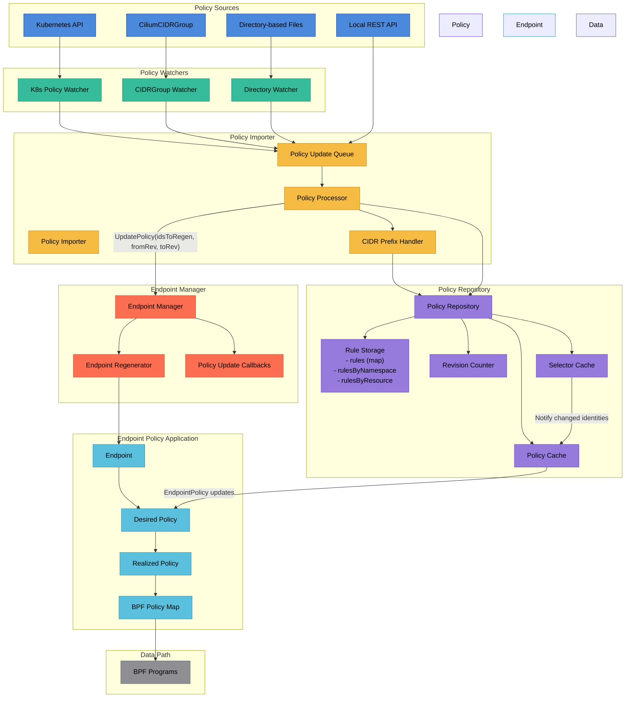

# Cilium Policy Creation Flow

This document describes the architecture and flow of how network policies are created, processed, and applied in Cilium.

## Architecture Overview Diagram


### Flow Summary

```
Policy Sources (Kubernetes API, CiliumCIDRGroup, Files, REST API)
    ↓
Policy Watchers (detect changes in policies)
    ↓
Policy Importer (processes, queues, and batches policy updates)
    ↓
CIDR Prefix Handler (allocates identities for CIDRs)
    ↓
Policy Repository (stores rules, maintains caches and revision counter)
    ↓
Endpoint Manager (coordinates updates to affected endpoints)
    ↓
Endpoint Policy Application (calculates and applies policies to endpoints)
    ↓
BPF Maps and Programs (enforce policies in the datapath)
```

## Component Descriptions

### Policy Sources
- **Kubernetes API**: Source for CiliumNetworkPolicy, CiliumClusterwideNetworkPolicy, K8sNetworkPolicy resources
- **CiliumCIDRGroup**: Source for IP CIDR grouping policies
- **Directory-based Files**: Source for policies stored as files on disk
- **Local REST API**: Source for policies added via Cilium API/CLI

### Policy Watchers
Policy watchers monitor changes from various policy sources and react to events (create, update, delete):

- **K8s Policy Watcher**: Watches Kubernetes API for policy changes
- **CIDRGroup Watcher**: Watches for CIDR group changes
- **Directory Watcher**: Monitors the filesystem for policy file changes

The watchers translate policy definitions from their respective formats into a common internal representation and forward them to the Policy Importer.

### Policy Importer
- **Policy Queue**: Buffers incoming policy updates for batched processing
- **Prefix Handler**: Manages CIDR prefixes from policies, updating the IPCache
- **Policy Processor**: Core processing logic that:
  - Allocates local identities for CIDR prefixes
  - Updates policies in the repository
  - Tracks affected identities for endpoint regeneration
  - Sends policy update notifications

### Policy Repository
Central storage for all policy rules with several key components:
- **Rule Storage**: Maintains indexed maps of rules:
  - `rules`: Main storage mapping rule keys to rule objects
  - `rulesByNamespace`: Indexes rules by namespace
  - `rulesByResource`: Indexes rules by resource ID
- **Revision Counter**: Tracks policy version for change detection
- **Policy Cache**: Caches computed policies per identity for performance
- **Selector Cache**: Efficiently maps endpoint selectors to matching identities

### Endpoint Manager
- **Endpoint Manager**: Manages all endpoints in the node
- **Endpoint Regenerator**: Handles endpoint regeneration process
- **Policy Update Callbacks**: Notifies registered components about policy changes

### Endpoint Policy Application
- **Endpoint**: Represents a container/pod network endpoint
- **Desired Policy**: The newly calculated policy that should be applied
- **Realized Policy**: The policy that has been successfully applied
- **Policy Map**: BPF map containing policy rules enforced in the datapath

### Data Path
- **BPF Programs**: Kernel programs that enforce policies at the datapath level

## Policy Creation Flow

1. **Policy Event Detection**:
   - Policy changes are detected by dedicated watchers
   - Each policy source (Kubernetes, file, API) has its own watcher

2. **Policy Translation**:
   - Watchers normalize policies into a common format
   - Policies are encapsulated in `PolicyUpdate` objects

3. **Policy Queuing**:
   - Updates are sent to the policy importer's queue
   - Updates are batched for efficient processing

4. **CIDR Identity Allocation**:
   - Prefix handler extracts CIDR prefixes from policies
   - Local identities are allocated for these prefixes
   - IPCache is updated with prefix metadata

5. **Policy Repository Update**:
   - Policies are added/replaced in the repository
   - Rules are indexed by different criteria (namespace, resource)
   - Repository revision number is incremented
   - Set of affected identities is calculated

6. **Selector Cache Updates**:
   - New selectors are added to the selector cache
   - Matching identities are calculated for each selector

7. **Endpoint Policy Propagation**:
   - Endpoint Manager is notified with list of affected identities
   - For affected endpoints, regeneration is triggered
   - Unaffected endpoints only update their policy revision

8. **Endpoint Policy Application**:
   - Endpoint calculates desired policy from repository
   - Policy changes are translated into policy map updates
   - Realized policy is set after successful application

9. **BPF Map Updates**:
   - Policy map changes are applied to BPF maps
   - Datapath starts enforcing the new policy rules