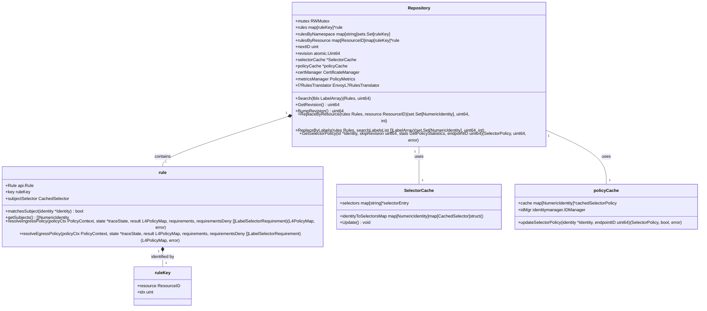
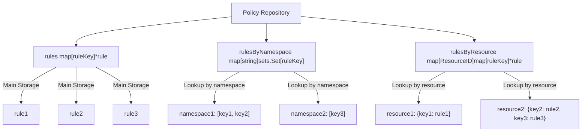
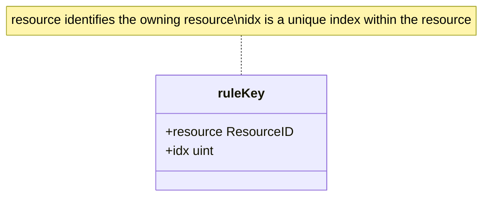
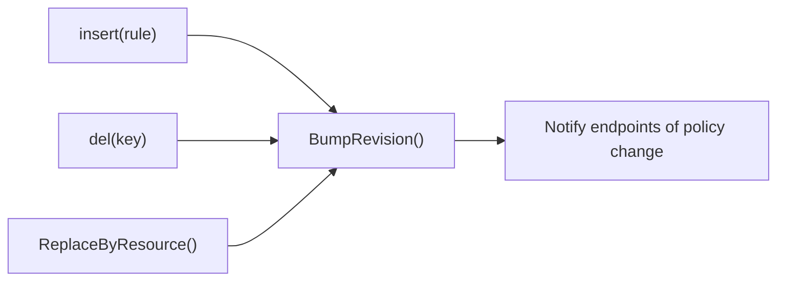
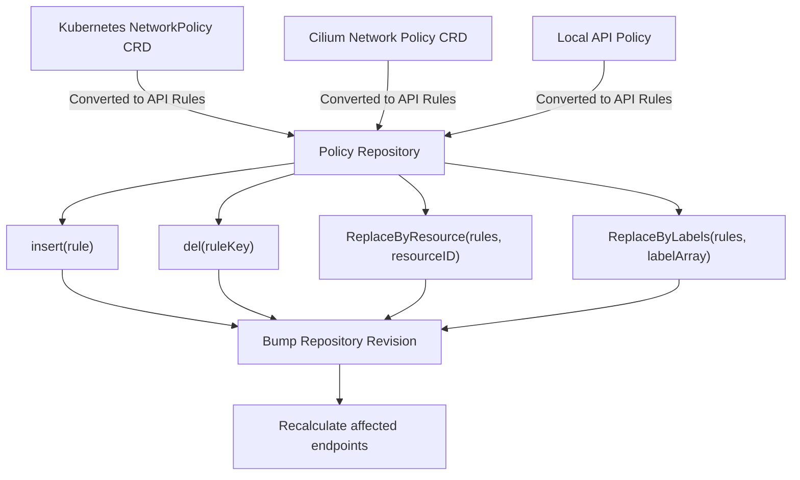
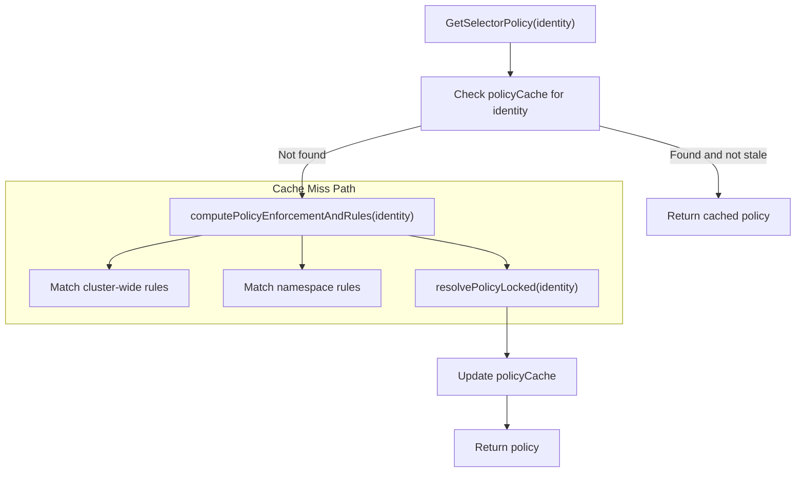
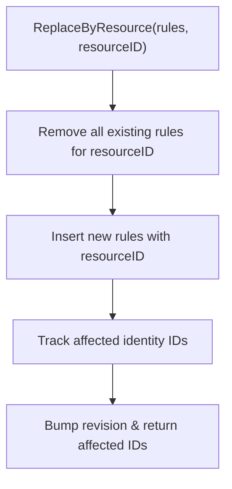

# Cilium Policy Repository Architecture

The Policy Repository is a core component of Cilium's networking security system. It stores and manages all network policies that control traffic between workloads in a cluster. This document explains the architecture of the Policy Repository, its key components, storage strategies, and how it's optimized for efficient policy lookups and enforcement.

## Overview

The Policy Repository is designed to efficiently store and query network policies. It maintains multiple indexing strategies to optimize different types of lookups and organizes policies by resource, namespace, and other attributes.


## Key Components

### Repository

The core structure that manages all policy rules and provides lookups based on different criteria.

### Rule Storage Strategy

The Repository uses multiple indexing strategies for efficient policy lookups:


### Rule Key Structure

Each rule in the repository is identified by a unique `ruleKey`:


## Storage Optimization

### Efficient Lookup Strategies

The Policy Repository enables different types of efficient lookups:

1. **Resource-based lookup**: Through `rulesByResource` index
2. **Namespace-based lookup**: Through `rulesByNamespace` index
3. **Label-based lookup**: Through label matching in the `Search` method

### Policy Revision Tracking

Each change to the repository increments a revision counter that allows components to detect when policies have changed.


## Example Policy Processing Flow

The following diagram shows how policies flow from Kubernetes into the Policy Repository:


## Example: Storage of a Network Policy

Let's examine how a simple Kubernetes NetworkPolicy is stored in the repository:

```yaml
apiVersion: networking.k8s.io/v1
kind: NetworkPolicy
metadata:
  name: test-network-policy
  namespace: default
spec:
  podSelector:
    matchLabels:
      role: db
  policyTypes:
  - Ingress
  - Egress
  ingress:
  - from:
    - ipBlock:
        cidr: 172.17.0.0/16
        except:
        - 172.17.1.0/24
    - namespaceSelector:
        matchLabels:
          project: myproject
    - podSelector:
        matchLabels:
          role: frontend
    ports:
    - protocol: TCP
      port: 6379
  egress:
  - to:
    - ipBlock:
        cidr: 10.0.0.0/16
    ports:
    - protocol: TCP
      port: 5978
```

This policy would be represented in the repository as:

1. A `rule` object with ingress and egress rules.
2. A `ruleKey` with:
   - `resource` identifying the NetworkPolicy resource 
   - `idx` set to a unique index (usually 0 since a single K8s NetworkPolicy maps to one Cilium rule)
3. Entries in all indexing maps:
   - Added to `rules` with the ruleKey as the key
   - Added to `rulesByNamespace["default"]` 
   - Added to `rulesByResource[resourceID]` where resourceID uniquely identifies the K8s NetworkPolicy

## Lookup Operations

### Identity-based Policy Lookup

When determining what policies apply to an endpoint with a given identity:


### Resource-based Policy Management

When replacing policies associated with a resource (e.g., when a NetworkPolicy is updated):


## Optimizations

1. **Revision-based Skip**: The `GetSelectorPolicy` method accepts a `skipRevision` parameter to avoid recomputing policies when the repository hasn't changed.

2. **Namespace-based Indexing**: Rules are indexed by namespace for faster lookups when evaluating which policies apply to pods in a specific namespace.

3. **Resource-based Management**: Rules are grouped by the resource that created them, allowing efficient updates when resources change.

4. **Label-based Filtering**: The repository can efficiently find rules that match specific label sets.

## Conclusion

The Cilium Policy Repository architecture is designed for efficiency and scalability, with multiple indexing strategies to optimize different types of lookups. Its structure enables Cilium to efficiently enforce network policies across a large number of endpoints while minimizing the computational overhead of policy evaluation.