# Agent-Side Data Structures for Centralized Policies

When Cilium operates with the `enable-centralized-network-policy` mode active, Cilium agents will subscribe to `CiliumResolvedPolicies` (CRP) Custom Resources published by a central controller. These CRPs contain policy rules where subject selectors have been resolved to specific security identities, and peer selectors within rules are also resolved to security identities.

This document outlines the proposed internal data structures the Cilium agent will use to store and manage the information derived from these CRPs.

## Core Data Structures

The agent will primarily use two main structures:

1.  A canonical store for the rules derived from each CRP.
2.  An index to map local subject identities to the CRPs that apply to them.

### `CRPPeerRule`

This structure represents a component of an ingress or egress rule within a parsed CRP. It associates a set of peer `NumericIdentities` with a specific L3/L4/L7 configuration. This structure directly aligns with the `CRPPeerRule` defined in `pkg/k8s/apis/cilium.io/v2alpha1/crp_types.go`.

```go
// CRPPeerRule defines a component of an ingress or egress rule within a parsedCRP.
// It associates a set of peer NumericIdentities with a specific L3/L4/L7 configuration.
type CRPPeerRule struct {
    // MatchingPeerIdentities is a set of peer NumericIdentities that are allowed
    // (for ingress allow rules), denied (for ingress deny rules), targeted (for egress allow rules),
    // or denied from targeting (for egress deny rules) by this part of the rule,
    // sharing the same L3/L4/L7 configuration.
    MatchingPeerIdentities map[identity.NumericIdentity]struct{} `json:"matchingPeerIdentities"`

    // ToPorts is a list of destination ports identified by port number and
    // protocol, along with optional L7 rules and authentication requirements.
    // This directly uses the api.PortRules type.
    // For deny rules, these are the ports/protocols/L7 attributes to which traffic is denied.
    ToPorts api.PortRules `json:"toPorts,omitempty"`
}
```

### `CRPRuleSet`

This structure is the canonical representation of the policy information derived from a single `CiliumResolvedPolicies` CR.

```go
// CRPRuleSet is the agent's canonical representation of rules derived from
// a single CiliumResolvedPolicies Custom Resource.
type CRPRuleSet struct {
    // SourcePolicyUID is an identifier for the original K8s policy object
    // (e.g., Kubernetes NetworkPolicy UID, or CiliumNetworkPolicy/CiliumClusterwideNetworkPolicy Name/Namespace)
    // from which this resolved policy was derived.
    SourcePolicyUID string

    // CRPCRExampleRevision stores the resourceVersion (or a similar revision marker)
    // of the CiliumResolvedPolicies K8s Custom Resource object.
    CRPCRExampleRevision uint64

    // IngressRules is a list of rules that allow ingress traffic for the SubjectIdentities.
    IngressRules []CRPPeerRule

    // IngressDenyRules is a list of rules that explicitly deny ingress traffic for the SubjectIdentities.
    IngressDenyRules []CRPPeerRule

    // EgressRules is a list of rules that allow egress traffic for the SubjectIdentities.
    EgressRules []CRPPeerRule

    // EgressDenyRules is a list of rules that explicitly deny egress traffic for the SubjectIdentities.
    EgressDenyRules []CRPPeerRule

    // SubjectIdentities are the local numeric identities (security identities of local endpoints)
    // to which this set of rules applies.
    SubjectIdentities map[identity.NumericIdentity]struct{}
}
```

### `SubjectPolicyState`

This structure holds the computed policy for a specific subject identity, the revision at which it was computed, and the set of CRP UIDs that contributed to it. This is used to cache policies and avoid recomputation.

```go
// SubjectPolicyState holds the computed policy and related metadata for a subject identity.
type SubjectPolicyState struct {
    ComputedPolicy    *selectorPolicy         // The cached selector policy for this subject
    PolicyRevision    uint64                  // Repository revision at which ComputedPolicy was generated
    MatchingCRPUIDset map[string]*CRPRuleSet  // Set of UIDs of CRPs that apply to this subject, mapping to the CRPRuleSet itself
}
```

## Agent's Internal Stores

### `canonicalCRPRules`

A map holding all active `CRPRuleSet` objects, keyed by the UID of the `CiliumResolvedPolicies` CR from which they were derived.

```go
// Key: UID of the CiliumResolvedPolicy CR
// Value: Pointer to the CRPRuleSet
canonicalCRPRules map[string]*CRPRuleSet
```

### `subjectPolicyCache`

An index that maps a local `identity.NumericIdentity` to its `SubjectPolicyState`. This state includes the pre-computed `selectorPolicy` for that identity (derived from all applicable CRPs), the policy revision at which it was computed, and the set of CRP UIDs that were used, mapping directly to their `CRPRuleSet` pointers. This allows for efficient policy retrieval and avoids redundant computations.

```go
// Key: Local subject NumericIdentity
// Value: Pointer to the SubjectPolicyState
subjectPolicyCache map[identity.NumericIdentity]*SubjectPolicyState
```

## Workflow

Below are the detailed flows for handling CRPs and computing policies.

### Receiving/Updating a CRP CR

This flow describes how the agent processes a new or updated `CiliumResolvedPolicies` (CRP) Custom Resource.

1.  **Event: CRP CR Arrives**
    *   The agent's Kubernetes watcher detects a new CRP CR or an update to an existing one.

2.  **Parse CRP to `CRPRuleSet`**
    *   The received CRP CR is unmarshalled and transformed into the agent's internal `CRPRuleSet` structure. This includes parsing `IngressRuleIdentities`, `IngressDenyRuleIdentities`, `EgressRuleIdentities`, and `EgressDenyRuleIdentities` from the CRP's spec into the corresponding fields in `CRPRuleSet`.

3.  **Store or Update `CRPRuleSet` in `canonicalCRPRules`**
    *   The `CRPRuleSet` is stored/updated in the `canonicalCRPRules` map, keyed by the CRP CR's UID.
    *   Identify the set of old subject identities if this is an update.

4.  **Update `subjectPolicyCache` for Affected Subjects**
    *   Determine all subject identities affected by this CRP change (newly added, removed, or existing subjects of this CRP).
    *   For each affected `NumericIdentity`:
        *   Retrieve or create its `SubjectPolicyState` in `subjectPolicyCache`.
        *   Update its `MatchingCRPUIDset` to reflect the addition/removal of the current CRP's UID, storing a pointer to the `CRPRuleSet` from `canonicalCRPRules`.
        *   Mark its `ComputedPolicy` as stale by setting `PolicyRevision` to 0 or clearing `ComputedPolicy`. This forces recalculation on the next policy request for this subject.

5.  **End of Flow:** The agent has processed the CRP update. The actual policy re-computation for affected subjects is deferred until requested.

### Deleting a CRP CR

This flow describes how the agent processes the deletion of a `CiliumResolvedPolicies` (CRP) Custom Resource.

1.  **Event: CRP CR Deleted**
    *   The agent's Kubernetes watcher detects the deletion of a CRP CR.

2.  **Retrieve `CRPRuleSet` and Identify Affected Subjects**
    *   The agent looks up the `CRPRuleSet` in `canonicalCRPRules` using the UID of the deleted CRP.
    *   The `SubjectIdentities` from this `CRPRuleSet` are the ones affected.

3.  **Update `subjectPolicyCache` for Affected Subjects**
    *   For each affected `NumericIdentity` (from the deleted CRP's `SubjectIdentities`):
        *   Retrieve its `SubjectPolicyState` from `subjectPolicyCache`.
        *   Remove the deleted CRP's UID from its `MatchingCRPUIDset`.
        *   Mark its `ComputedPolicy` as stale by setting `PolicyRevision` to 0 or clearing `ComputedPolicy`.
        *   If a `SubjectPolicyState`'s `MatchingCRPUIDset` becomes empty, the `SubjectPolicyState` entry itself might be removed from `subjectPolicyCache` if desired.

4.  **Remove `CRPRuleSet` from Store**
    *   The `CRPRuleSet` is removed from `canonicalCRPRules`.

5.  **End of Flow:** The agent has processed the CRP deletion.

### Computing `SelectorPolicy` for a Local Identity

This flow describes how the agent computes or retrieves the effective `selectorPolicy` for a given local endpoint identity.

1.  **Event: `GetSelectorPolicy(localID, currentRepoRevision)` Called**
    *   A request is made to get the policy for `localID` at the `currentRepoRevision`.

2.  **Lookup in `subjectPolicyCache`**
    *   The agent attempts to retrieve the `SubjectPolicyState` for `localID` from `subjectPolicyCache`.
    *   If a `SubjectPolicyState` exists and its `subjectPolicyState.ComputedPolicy != nil` and `subjectPolicyState.PolicyRevision == currentRepoRevision`:
        *   The cached `ComputedPolicy` is valid and is returned. The flow ends here.

3.  **Policy Recomputation Needed:**
    *   If no valid cached policy exists, a recomputation is necessary.
    *   If `SubjectPolicyState` was found, use its `MatchingCRPUIDset`. If no `SubjectPolicyState` exists for `localID` (e.g., new identity or previously no CRPs applied), its `MatchingCRPUIDset` is considered empty.

4.  **Access Relevant `CRPRuleSet`s**
    *   The relevant `CRPRuleSet` objects are the values (pointers to `CRPRuleSet`) in the `subjectPolicyState.MatchingCRPUIDset` map. Iterate through these `*CRPRuleSet` pointers. If the `MatchingCRPUIDset` is empty or nil, there are no specific rules to apply beyond any default behavior.

5.  **Aggregate Rules**
    *   Aggregate all `IngressRules`, `IngressDenyRules`, `EgressRules`, and `EgressDenyRules` from the `CRPRuleSet`s obtained in the previous step. Keep allow and deny rules distinct during aggregation if necessary for later processing.

6.  **Build Final `selectorPolicy`**
    *   Process the aggregated rules to construct the `L4Policy`, `PolicyMapState`, etc., for the new `selectorPolicy`.
    *   When creating `L4Filter` instances (or their equivalents) from these rules:
        *   Rules from `IngressRules` and `EgressRules` will result in allow policies (e.g., `L4Filter.PerSelectorPolicy.IsDeny = false`).
        *   Rules from `IngressDenyRules` and `EgressDenyRules` will result in deny policies (e.g., `L4Filter.PerSelectorPolicy.IsDeny = true`).

7.  **Update `subjectPolicyCache`**
    *   Ensure a `SubjectPolicyState` entry exists for `localID` in `subjectPolicyCache`.
    *   Store the newly computed `selectorPolicy` as `ComputedPolicy` in this `SubjectPolicyState`.
    *   Set its `PolicyRevision` to `currentRepoRevision`.
    *   The `MatchingCRPUIDset` within this `SubjectPolicyState` should already be up-to-date from CRP add/delete flows.

8.  **Return `selectorPolicy`**
    *   The newly computed `selectorPolicy` is returned.

9.  **End of Flow.**

This approach aims to minimize data redundancy while providing efficient management and lookup capabilities for policies derived from CRPs.

## Structural Relationships (Class Diagram)

```mermaid
classDiagram
    direction LR

    class AgentCRPPolicies {
        +canonicalCRPRules: Map of string → CRPRuleSet
        +subjectPolicyCache: Map of NumericIdentity → SubjectPolicyState
    }

    class SubjectPolicyState {
        +ComputedPolicy: SelectorPolicy
        +PolicyRevision: uint64
        +MatchingCRPUIDset: Map of string → CRPRuleSet
    }

    class CRPRuleSet {
        +SourcePolicyUID: string
        +CRPCRExampleRevision: uint64
        +SubjectIdentities: Map of NumericIdentity → empty struct
        +IngressRules: List of CRPPeerRule
        +IngressDenyRules: List of CRPPeerRule
        +EgressRules: List of CRPPeerRule
        +EgressDenyRules: List of CRPPeerRule
    }

    class CRPPeerRule {
        +MatchingPeerIdentities: Map of NumericIdentity → empty struct
        +ToPorts: List of PortRule
    }

    class PortRule {
        +Ports: List of PortProtocol
        +Rules: L7Rules
        +Authentication: Authentication
        +TerminatingTLS: TLSContext
        +OriginatingTLS: TLSContext
    }

    class NumericIdentity
    class PortProtocol
    class L7Rules
    class Authentication
    class TLSContext
    class SelectorPolicy

    AgentCRPPolicies o-- "*" CRPRuleSet : stores via UID in canonicalCRPRules
    AgentCRPPolicies o-- "*" SubjectPolicyState : caches by identity
    SubjectPolicyState --> "0..1" SelectorPolicy : has computed policy
    SubjectPolicyState ..> CRPRuleSet : references via UID map to CRPRuleSet pointers
    CRPRuleSet o-- "*" CRPPeerRule : ingress
    CRPRuleSet o-- "*" CRPPeerRule : ingressDeny
    CRPRuleSet o-- "*" CRPPeerRule : egress
    CRPRuleSet o-- "*" CRPPeerRule : egressDeny
    CRPRuleSet ..> NumericIdentity : subject identities
    CRPPeerRule o-- "*" PortRule : toPorts (api.PortRules)
    CRPPeerRule ..> NumericIdentity : peer match
    PortRule o-- "*" PortProtocol : ports
    PortRule o-- "0..1" L7Rules : rules
    PortRule o-- "0..1" Authentication : authentication
    PortRule o-- "0..1" TLSContext : terminatingTLS
    PortRule o-- "0..1" TLSContext : originatingTLS
```


**Explanation of Relationships:**

*   `AgentCRPPolicies`: Conceptual representation of the agent's CRP policy stores.
    *   `canonicalCRPRules`: Stores `CRPRuleSet` objects, keyed by CRP CR UID.
    *   `subjectPolicyCache`: Maps a `NumericIdentity` (local subject) to its `SubjectPolicyState`.
*   `SubjectPolicyState`: Caches the `ComputedPolicy` (`SelectorPolicy`) for a subject, the `PolicyRevision` of this computation, and the `MatchingCRPUIDset` (map of CRP UIDs to their `CRPRuleSet` pointers, for those CRPs that contributed to this policy).
*   `CRPRuleSet`: Information from a single `CiliumResolvedPolicies` CR.
    *   Contains `IngressRules`, `IngressDenyRules`, `EgressRules`, and `EgressDenyRules` (lists of `CRPPeerRule`).
    *   Applies to a set of `SubjectIdentities`.
*   `CRPPeerRule`: A specific rule component.
    *   Configured with `ToPorts` (which is `api.PortRules`, a list of `api.PortRule`).
    *   Matches a set of `MatchingPeerIdentities`.
*   `PortRule` (representing `api.PortRule`): L4, L7, Auth, and TLS configuration.
    *   Defines `Ports` (`[]api.PortProtocol`), optionally `Rules` (`*api.L7Rules`), `Authentication` (`*api.Authentication`), `TerminatingTLS` (`*api.TLSContext`), and `OriginatingTLS` (`*api.TLSContext`).
*   `SelectorPolicy`: Represents the computed policy for an identity (details not shown in this diagram but is the type of `ComputedPolicy`).

This diagram illustrates that `AgentCRPPolicies` now uses `subjectPolicyCache` to store `SubjectPolicyState` for each relevant `NumericIdentity`. This `SubjectPolicyState` holds the actual computed `SelectorPolicy` and the necessary metadata to validate this cache.
The `CRPRuleSet` now explicitly includes deny rules, and `CRPPeerRule` directly uses `api.PortRules` (represented as a list of `PortRule` in the diagram for clarity of its components) for its L4-L7 configuration.
