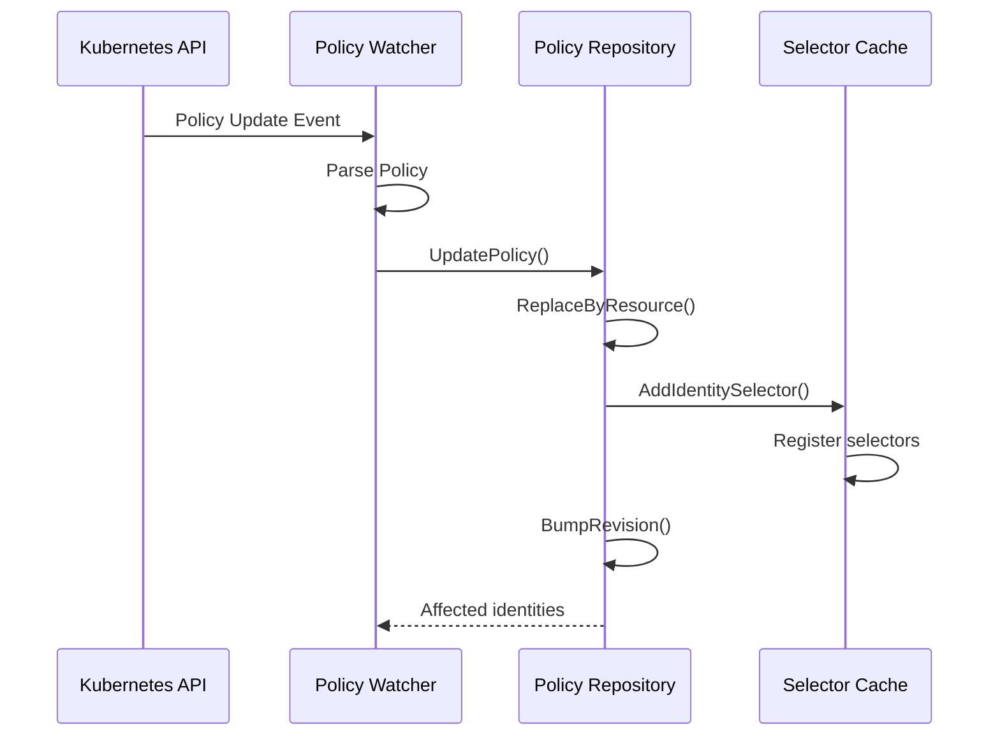
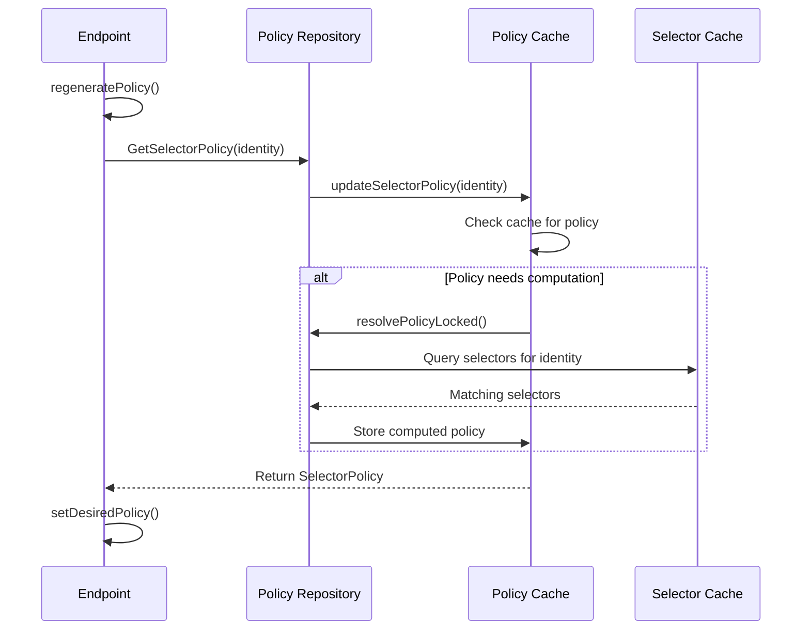
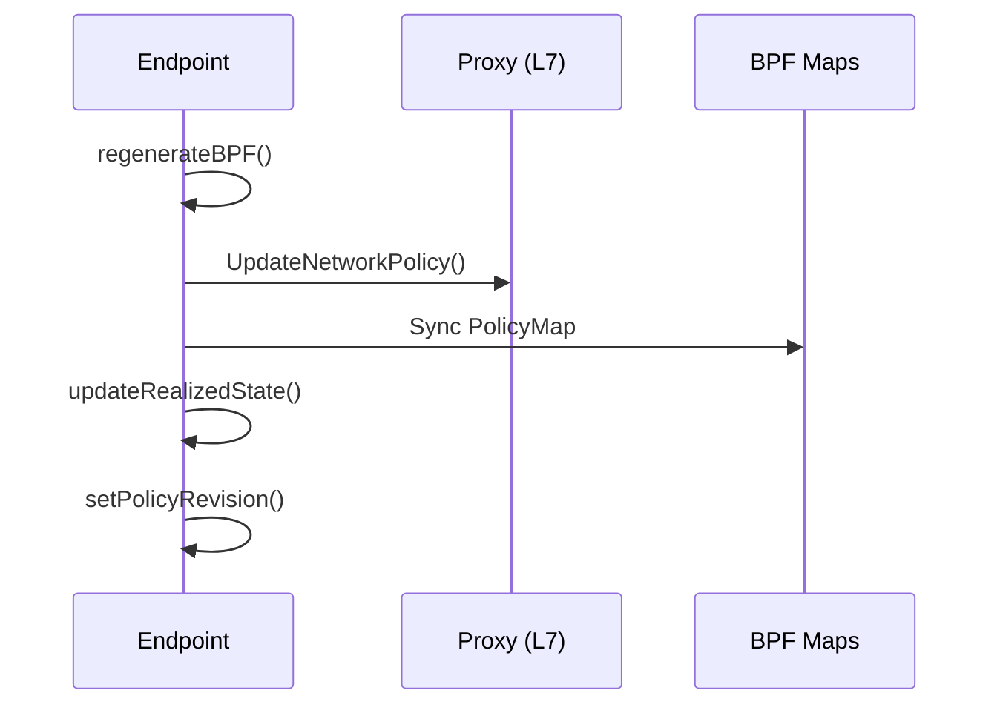
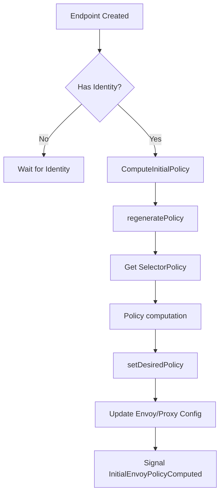
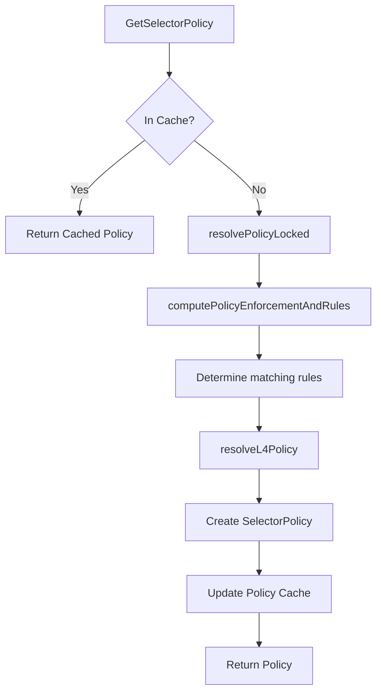
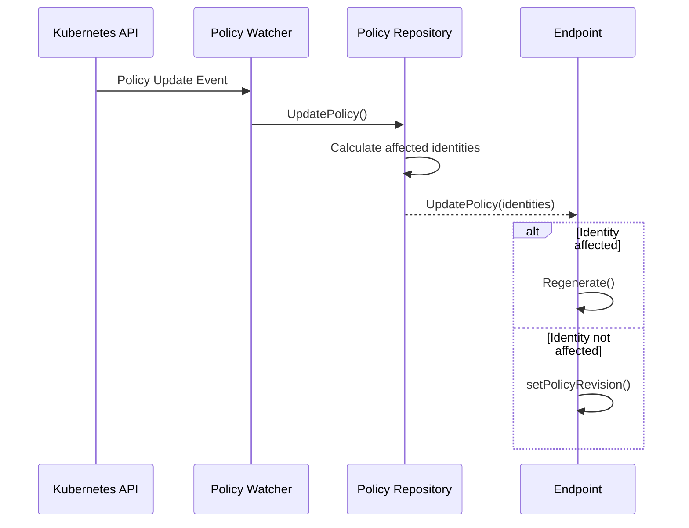
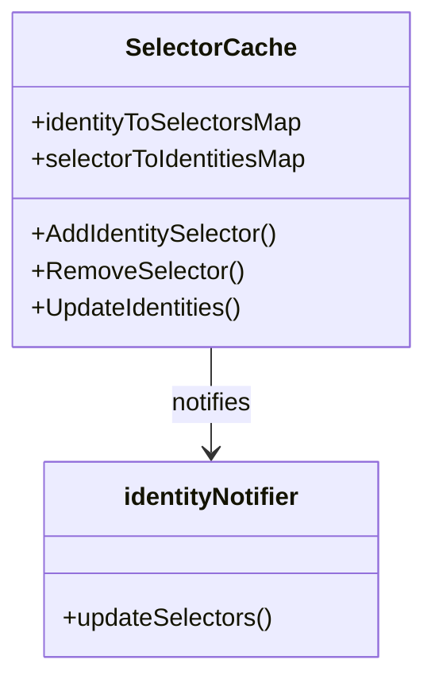
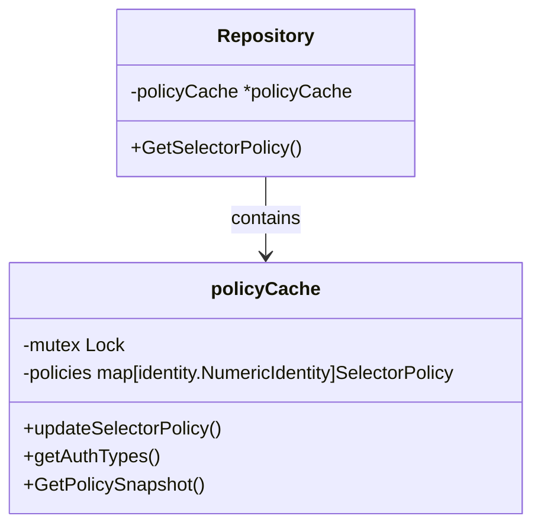

# Policy Computation Flow in Cilium Endpoints

## Overview

Cilium's policy computation is a multi-stage process that transforms high-level network policies into efficient BPF programs that enforce rules at the datapath level. This process involves several components working together:

1. Policy Repository (central store of all policies)
2. Selector Cache (optimizes selector evaluations)
3. Policy Cache (stores compiled policies per identity)
4. Endpoint (applies the relevant policies based on its identity)

## Key Components

### Policy Repository

The `PolicyRepository` is the central storage for all network policies in Cilium. It stores:
- Rules from Kubernetes NetworkPolicies
- Rules from CiliumNetworkPolicies
- Rules from CiliumClusterwideNetworkPolicies
- Rules from CiliumResolvedPolicies

### Selector Cache

The `SelectorCache` optimizes selector-based policy lookups:
- Caches selectors from policies
- Tracks which identities match each selector
- Notifies affected components when identity changes impact selectors

### Policy Cache

The `policyCache` (embedded in `Repository`) stores computed policies per identity:
- Maps from numeric identity to `selectorPolicy`
- Avoids recomputing policies for identities that haven't changed

### Endpoint

The endpoint:
- Has an assigned security identity
- Requests a policy computation based on its identity
- Applies the computed policy to its specific datapath

## Sequential Flow of Policy Computation

### 1. Policy Import Phase

When a policy is imported or updated:

1. Kubernetes API server produces a policy update event
2. Cilium's policy watcher receives and parses the policy
3. The parsed rules are sent to the policy repository
4. The repository registers policy selectors with the selector cache
5. The policy revision is incremented
6. The repository tracks which identities are affected by the policy change

### 2. Endpoint Policy Computation Phase

When an endpoint needs to compute its policy:

1. Endpoint begins policy regeneration with `regeneratePolicy()`
2. Endpoint requests a selector policy from the repository based on its identity
3. Repository delegates to the policy cache to find or compute the policy
4. Policy cache checks if it already has a cached policy for this identity
5. If needed, the repository resolves the policy based on which rules select the endpoint's identity
6. The resulting policy is stored in the cache and returned to the endpoint
7. The endpoint sets this as its desired policy

### 3. Policy Realization Phase

After computing the desired policy, the endpoint applies it to its datapath:

1. The endpoint regenerates its BPF programs
2. For L7 policies, the endpoint updates the proxy configuration
3. The endpoint synchronizes its policy map with the computed policy
4. The realized policy state is updated to match the desired state
5. The endpoint policy revision is updated to match the repository's revision

## Detailed Walkthrough

### 1. Initial Policy Computation

When an endpoint is first created:

1. The endpoint waits for an identity to be assigned
2. Once an identity is available, `ComputeInitialPolicy()` is called
3. This triggers `regeneratePolicy()` to start the policy computation
4. The repository is queried for the security identity's policy
5. The computed policy is set as the endpoint's desired policy
6. The L7 proxy configuration is updated (if needed)
7. The initial policy computation is signaled as complete

### 2. Policy Evaluation

Inside the policy repository, when computing which policies apply to an identity:

1. The policy repository searches its cache for a policy matching the identity
2. If not found or outdated, it resolves the policy from scratch
3. It determines which rules match the identity's labels
4. It resolves which L4 policies apply (both ingress and egress)
5. It creates a `selectorPolicy` object customized for the identity
6. The policy is cached for future use
7. The policy is returned to the endpoint

### 3. Policy Updates

When policies change:

1. When a policy changes, the repository determines which identities are affected
2. For affected endpoints, a regeneration is triggered
3. For unaffected endpoints, only the policy revision is updated (no regeneration)

## The Role of Caches

Cilium uses multiple caching layers to optimize policy computation:

### Selector Cache

- Tracks which selectors are affected by identity changes
- Avoids recomputing selector matches for unchanged identities
- Allows efficient updates when identities are added or removed

### Policy Cache

- Caches compiled policies per identity
- Avoids recomputing policies for identities that haven't changed
- Maintains a snapshot of policies for all identities

## Key Insights

1. **Efficiency Through Caching**: Cilium avoids recomputing policies unnecessarily by caching at multiple levels.

2. **Identity-Centric**: Policy computation revolves around security identities, not individual endpoints. This allows sharing policy computation among endpoints with the same identity.

3. **Asynchronous Updates**: Policy computation is performed asynchronously from the policy update pipeline, allowing Cilium to handle high policy churn efficiently.

4. **Incremental Computation**: The system is designed to compute only what changed, avoiding full recomputation when possible.

5. **Revision Tracking**: Each policy update increments a revision number, allowing endpoints to determine if they need to update their policies.

## Typical Flow for a New Endpoint

1. The endpoint is created and assigned a security identity based on its labels
2. The endpoint triggers initial policy computation
3. The repository checks if a policy is cached for this identity
4. If not cached, the repository computes which policies select this identity
5. A selector policy is created and cached
6. The endpoint sets this as its desired policy
7. The endpoint regenerates, updating proxy configuration and policy maps
8. The endpoint's policy revision is updated to match the repository's

This policy computation process is highly optimized to minimize the performance impact of policy changes in large clusters, allowing Cilium to efficiently handle complex network policies across thousands of endpoints.
