# GetSelectorPolicy Flow: Complete Documentation

## Overview

This document provides comprehensive documentation of the GetSelectorPolicy flow in Cilium, detailing how L4PolicyMap, L4Policy, and L4Filters are created, merged, and managed. The flow represents the complete journey from Cilium Network Policy (CNP/CCNP) rules to BPF map entries that control traffic in the datapath.

## Table of Contents

1. [Architecture Overview](#architecture-overview)
2. [Core Components](#core-components)
3. [GetSelectorPolicy Flow Sequence](#getselectorpolicy-flow-sequence)
4. [Component Creation and Lifecycle](#component-creation-and-lifecycle)
5. [Policy Merging Process](#policy-merging-process)
6. [Selector Cache Operations](#selector-cache-operations)
7. [BPF Map State Generation](#bpf-map-state-generation)
8. [Complete Flow Diagrams](#complete-flow-diagrams)
9. [Class Diagrams](#class-diagrams)
10. [Key Data Structures](#key-data-structures)

## Architecture Overview

The GetSelectorPolicy flow is the core policy resolution mechanism in Cilium that transforms high-level network policies into low-level BPF map entries. The flow involves multiple components working together:

- **Repository**: Central policy storage and resolution engine
- **PolicyCache/Distillery**: Caching layer for resolved policies
- **SelectorCache**: Identity resolution and selector management
- **L4PolicyMap/L4Policy/L4Filter**: L4 policy structures
- **MapState**: BPF map entry generation

## Core Components

### Repository
- Central policy repository storing all CNP/CCNP rules
- Provides policy resolution for specific identities
- Manages policy revisions and rule matching
- **Key Method**: `GetSelectorPolicy()`, `resolvePolicyLocked()`

### PolicyCache (Distillery)
- Caches resolved selector policies per identity
- Manages policy lifecycle (creation, updates, deletion)
- Prevents duplicate policy calculations
- **Key Method**: `updateSelectorPolicy()`, `lookupOrCreate()`

### SelectorCache
- Manages mapping between selectors and numeric identities
- Provides incremental updates when identities change
- Caches selector evaluations for performance
- **Key Method**: `AddIdentitySelector()`, `UpdateIdentities()`

### L4PolicyMap
- Container for both ingress and egress L4 policies
- Top-level L4 policy structure per endpoint
- **Key Fields**: `Ingress`, `Egress` (both of type `L4Policy`)

### L4Policy
- Collection of L4 filters organized by protocol
- **Key Fields**: `HTTP`, `UDP`, `TCP`, `SCTP`, `ICMP`, `ICMPv6`

### L4Filter
- Individual L4 policy rule with port/protocol details
- Contains selector-specific policies and rule origins
- **Key Fields**: `Port`, `Protocol`, `PerSelectorPolicies`, `RuleOrigin`

## GetSelectorPolicy Flow Sequence

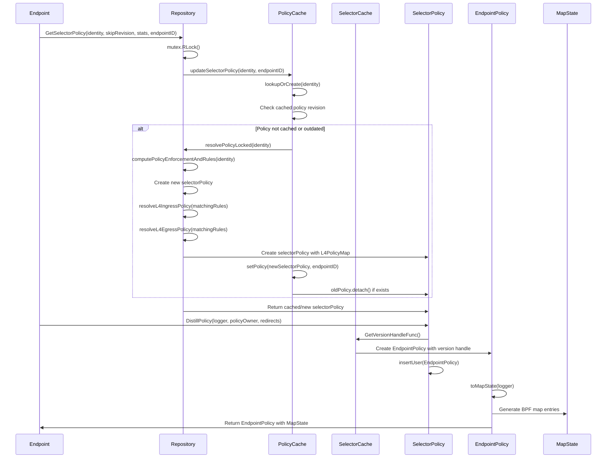

## Component Creation and Lifecycle

### L4Filter Creation Process

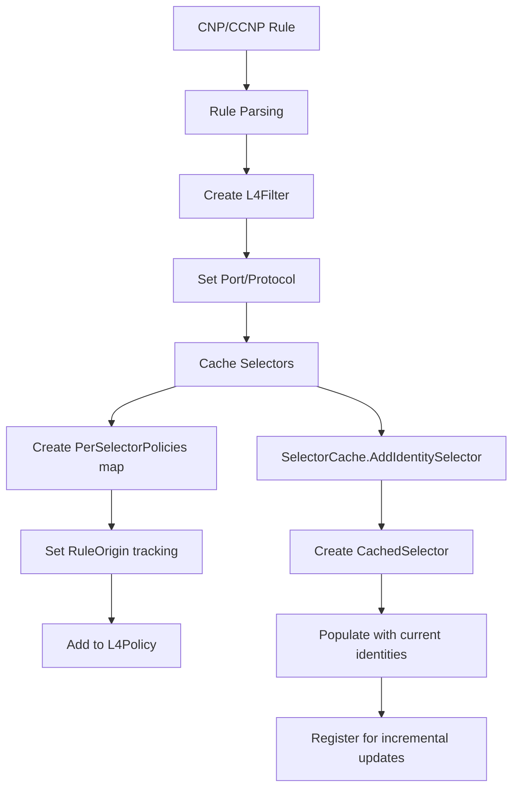

### L4Policy Assembly

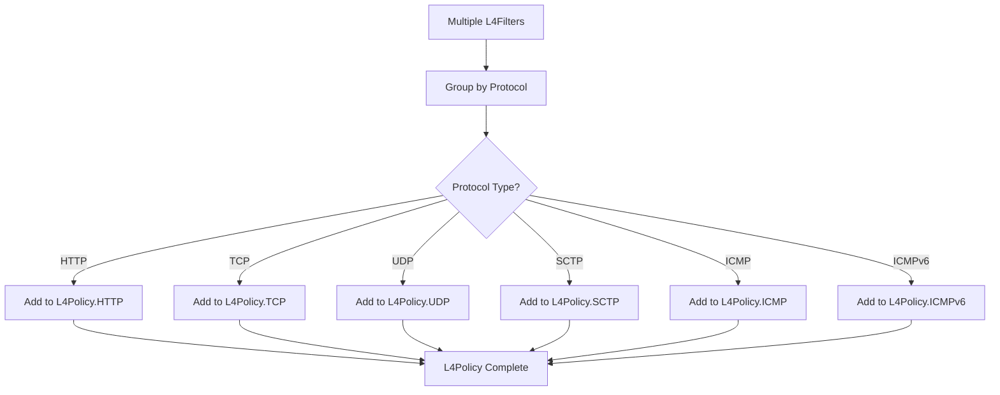

### L4PolicyMap Structure

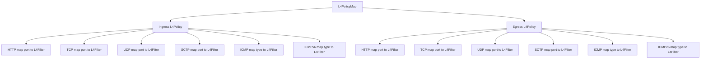

## Policy Merging Process

### Rule Merging Algorithm

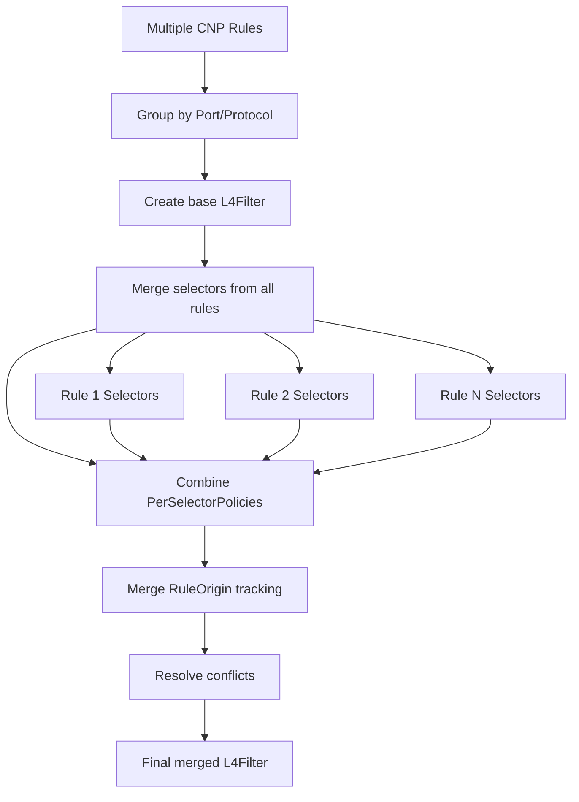

### Selector Policy Merging

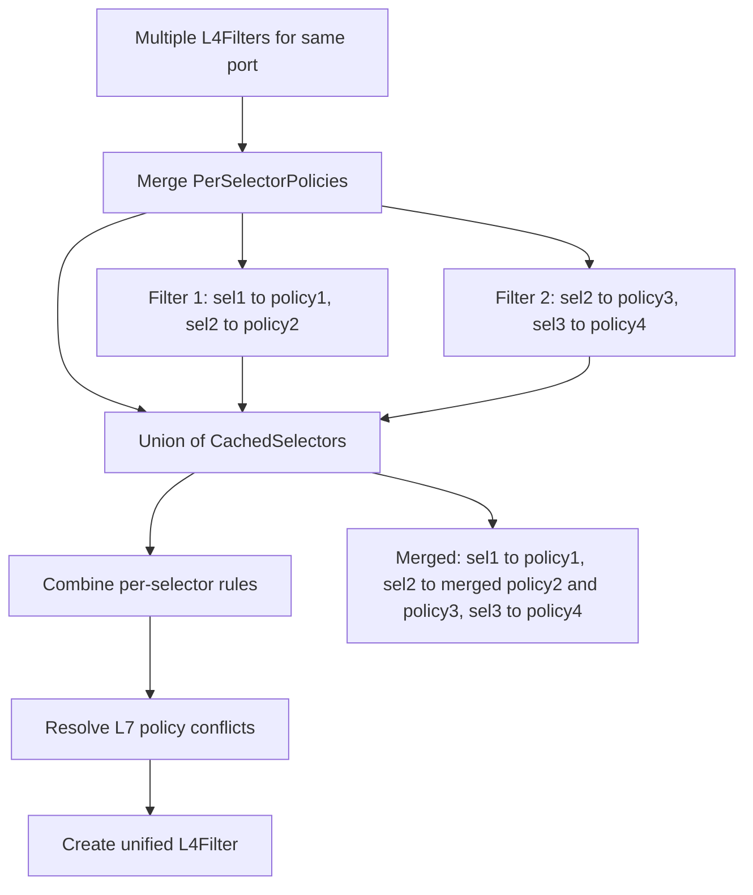

## Selector Cache Operations

### Identity Resolution Flow

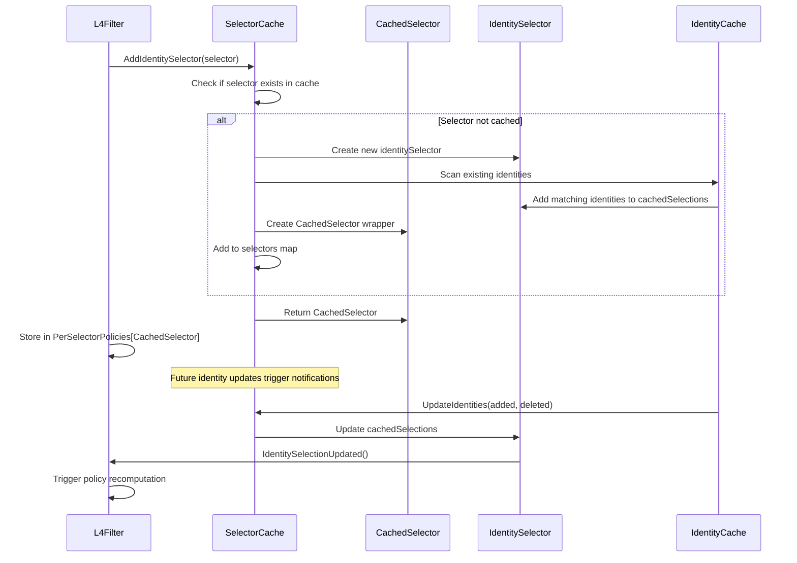

### Incremental Updates

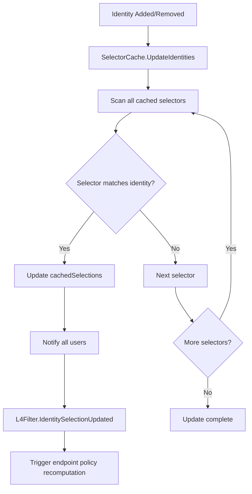

## BPF Map State Generation

### toMapState Process

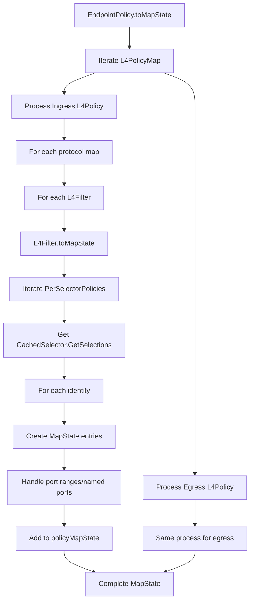

### MapState Entry Creation

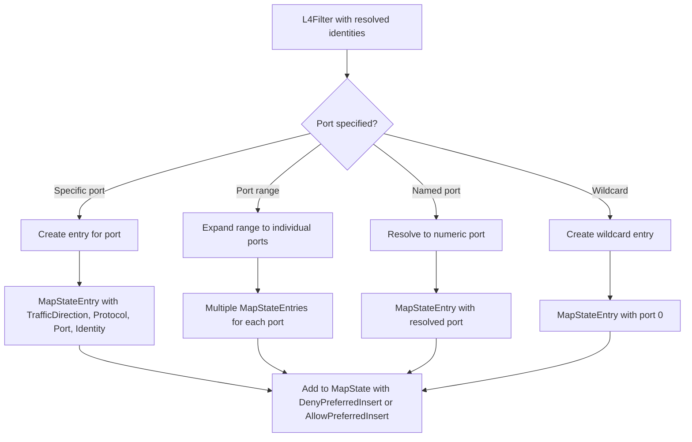

## Complete Flow Diagrams

### Full GetSelectorPolicy Flow

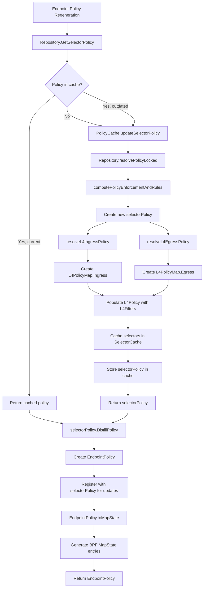

### Policy Update Flow

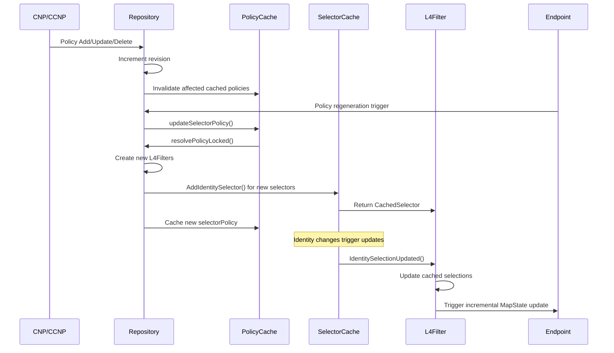

## Class Diagrams

### Core Policy Classes

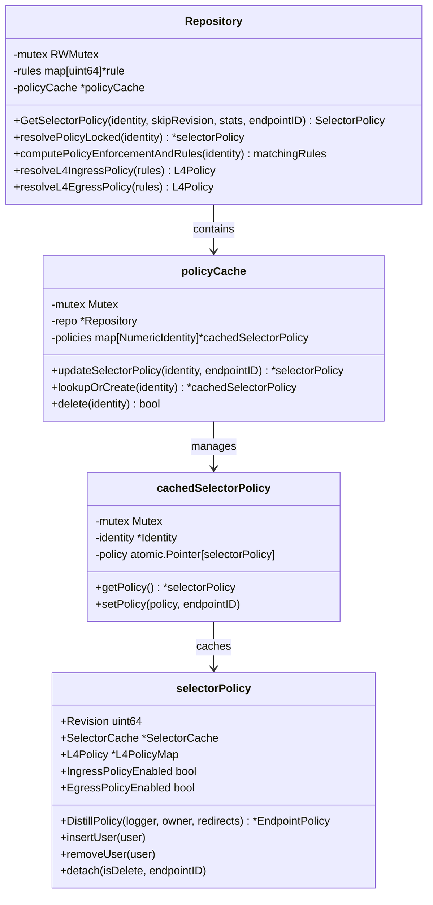

### L4 Policy Structure Classes

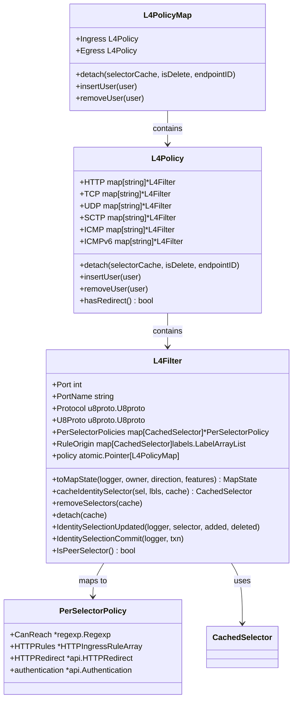

### Selector Cache Classes

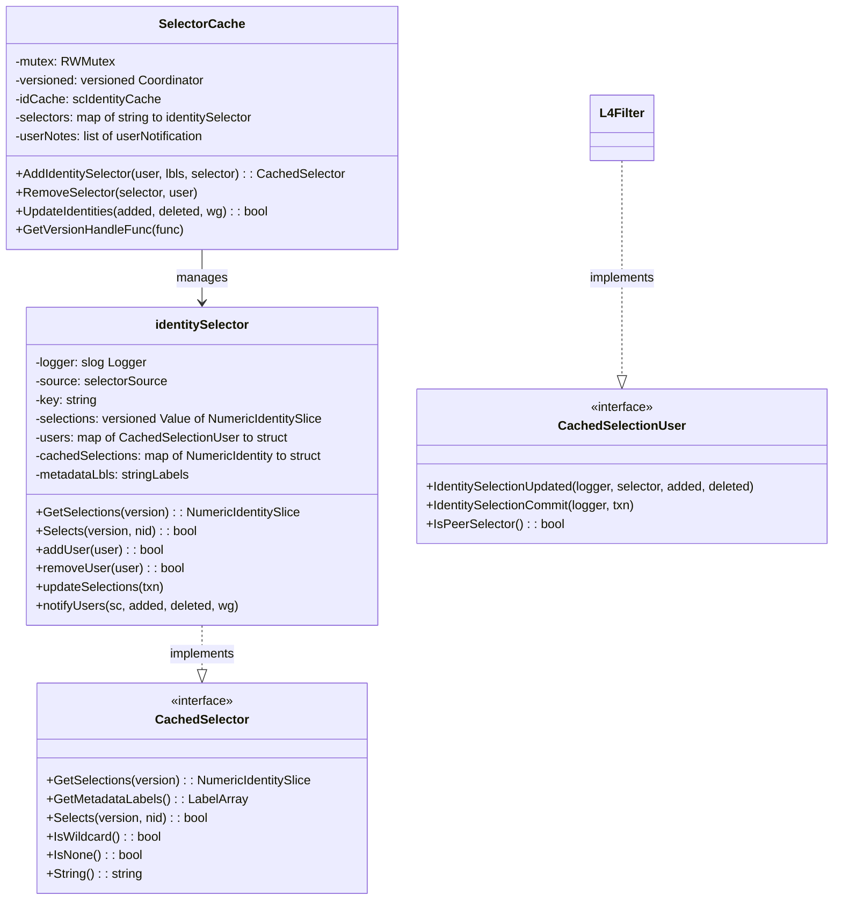

### EndpointPolicy and MapState Classes

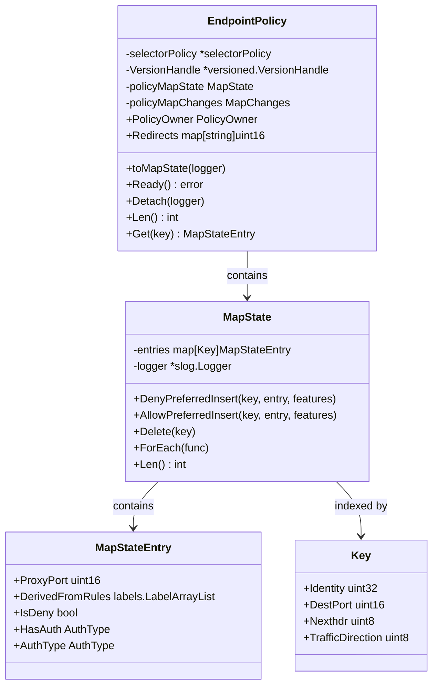

## Key Data Structures

### L4Filter Configuration

```go
type L4Filter struct {
    // Port configuration
    Port       int              // Numeric port (0 = wildcard)
    PortName   string           // Named port reference
    Protocol   u8proto.U8proto  // Protocol (TCP, UDP, etc.)
    
    // Selector-specific policies
    PerSelectorPolicies map[CachedSelector]*PerSelectorPolicy
    
    // Rule origin tracking for debugging
    RuleOrigin map[CachedSelector]labels.LabelArrayList
    
    // Reference to parent policy for incremental updates
    policy atomic.Pointer[L4PolicyMap]
}
```

### Selector Policy Resolution

```go
type selectorPolicy struct {
    Revision             uint64          // Policy revision
    SelectorCache        *SelectorCache  // Cached selectors
    L4Policy            *L4PolicyMap    // Resolved L4 policies
    IngressPolicyEnabled bool           // Ingress enforcement
    EgressPolicyEnabled  bool           // Egress enforcement
}
```

### Identity to Selector Mapping

```go
type identitySelector struct {
    source           selectorSource                    // Label selector logic
    selections       versioned.Value[NumericIdentitySlice] // Current selections
    users            map[CachedSelectionUser]struct{}  // Interested parties
    cachedSelections map[NumericIdentity]struct{}      // Fast lookup cache
}
```

### BPF Map Entries

```go
type MapStateEntry struct {
    ProxyPort         uint16                    // L7 proxy redirect port
    DerivedFromRules  labels.LabelArrayList     // Source policy rules
    IsDeny           bool                      // Deny vs Allow
    AuthType         AuthType                  // Authentication requirement
}
```

## Performance Considerations

### Caching Strategy

1. **Selector Caching**: Selectors are cached globally and shared across all policies
2. **Policy Caching**: Resolved policies are cached per identity to avoid recomputation
3. **Incremental Updates**: Only changed identities trigger selector re-evaluation
4. **Versioned Updates**: All updates are versioned to ensure consistency

### Optimization Techniques

1. **Lazy Evaluation**: Policies are only resolved when needed by endpoints
2. **Shared Selectors**: Identical selectors are deduplicated across policies
3. **Batch Updates**: Identity updates are batched to minimize policy recomputations
4. **Fast Path**: Common operations use optimized data structures and algorithms

## Conclusion

The GetSelectorPolicy flow represents a sophisticated policy resolution system that efficiently transforms high-level network policies into low-level datapath configurations. The multi-layered caching, incremental updates, and shared selector architecture ensure both correctness and performance at scale.

The flow demonstrates key architectural principles:
- **Separation of Concerns**: Clear separation between policy storage, resolution, and caching
- **Incremental Processing**: Minimal recomputation when policies or identities change
- **Consistency**: Versioned updates ensure consistent policy state across components
- **Performance**: Multiple levels of caching and optimization for high-throughput scenarios

This documentation serves as a comprehensive guide for understanding, debugging, and extending Cilium's policy resolution system.
